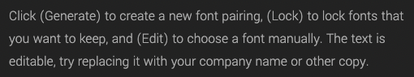

# Smarty Energy - View your smart meter on your phone

☝️ Smarty

The goal is to:
* Surface energy usage info (quantity and price) to users in an intuitive way
* Have a smooth onboarding experience for associating your smart meter to your account
* Upsell the [Hildebrande smart meter](https://shop.glowmarkt.com/products/display-and-cad-combined-for-smart-meter-customers) to give you more up-to-date readings (realtime rather than half-hourly)

It will talk to the [the glowmarkt api](https://docs.glowmarkt.com/GlowmarktAPIDataRetrievalDocumentationIndividualUserForBright.pdf) directly so we don't handle any user data.

## Project Structure
Everything's in TypeScript, this is a yarn berry monorepo, stuff is located in [packages](./packages).

* [glowmarkt-api](./packages/glowmarkt-api) is a typed client library for [the glowmarkt api](https://docs.glowmarkt.com/GlowmarktAPIDataRetrievalDocumentationIndividualUserForBright.pdf) that gives access to the smart meter data. This is intended to be published to npm at some point.
* [smartmeter-graphql-schema](./packages/smartmeter-graphql-schema) is a graphql schema which uses the above api client library 
* [smartmeter-app](./packages/smartmeter-app) is an expo app, it uses apollo client because it has a nice developer experience. However, instead of talking to a graphql server it pulls in the above graphql schema and executes queries and mutations against it, so talks directly to the glowmarkt api.
* [smartmeter-graphql-server](./packages/smartmeter-graphql-server) is a graphql server which uses the above graphql schema, this is just for local dev to make it easier to debug the graphql schema, and not intended for production (we don't want to touch any user data)

## Todo
- [x] Set up the base project
- [ ] Wireframe the app
- [ ] Ensure all required data is accessible via the client library and schema
- [ ] Login / View Profile / Logout flow
- [ ] View live data flow
- [ ] View historical data
- [ ] Signup flow
- [ ] Associate IHD with app flow
- [ ] Hildebrande smart meter upsell flow
- [ ] Branding/Name/Visual Identity

## Stretch goal/Maybes
- [ ] Native widgets for android/iOS (would require ejection from expo)

## Visual Identity

### Keywords
- playful
- round
- friendly

### Mascot
Smarty

### Colour pallet
Pink:  [#ed839d](https://hexcolor.co/hex/ed839d)

Light Blue:  [#80c5f4](https://hexcolor.co/hex/80c5f4)

Dark Blue:   [#382d5e](https://hexcolor.co/hex/382d5e)

White:  [#efefef](https://hexcolor.co/hex/efefef)

### Typefaces
Headings: [Dosis](https://fonts.google.com/specimen/Dosis)

Subheadings: [Ubuntu](https://fonts.google.com/specimen/Ubuntu)

Body: [Yantramanav](https://fonts.google.com/specimen/Yantramanav)

